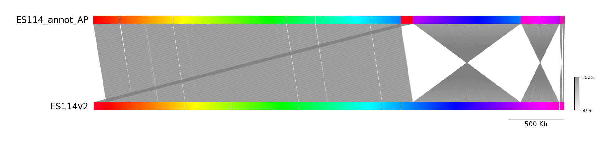
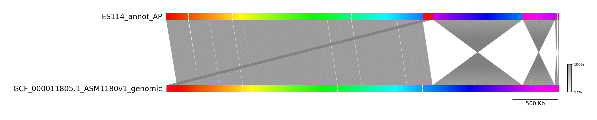
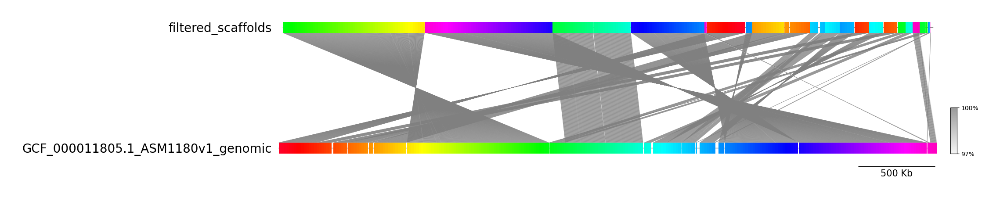

# Vibrio fischeri whole genome sequencing
Dec 2024, Defne Surujon

Input data can be found on [Google Drive](https://drive.google.com/drive/folders/1vph8vOCE5IXIXoPY5voq_syBOvHaSXsT)

### Comparison of Mark Mandel assembly vs 2008 assembly
* `ES114v2.fasta`: 2008 genome
* `ES114_annot_AP.fasta`: new genome re-annotated by Alix    
    
run fastANI to see if there are any large-scale differences
```
fastANI -k 20 -q ./drive-download-20241111T172643Z-001/ES114_annot_AP.fasta \
    -r ./drive-download-20241111T172643Z-001/ES114v2.fasta \
    -o ./output/fastani/ES114_2008_vs_new_fastANI.tsv \
    --visualize
```
visualize fastANI output
```
poetry run python ./code/fastani_visualize.py \
    ./drive-download-20241111T172643Z-001/ES114_annot_AP.fasta \
    ./drive-download-20241111T172643Z-001/ES114v2.fasta \
    ./output/fastani/ES114_2008_vs_new_fastANI.tsv.visual \
    ./output/fastani/ES114_2008_vs_new_fastANI.png
```


Overall the genomes overlap well.     
Since the variant analysis with BreSeq was done using the RefSeq assembly `ASM1180v1`, we also compare this genome to the new annotation from Alix. See the script `compare_refseq_vs_AP_asm.sh`.     

This comparison also looks fine overlap. Suspiciously like the prior comparison. 

### quality control
```
cd drive-download-20241111T172643Z-001/QUO1002548-20221114/Illumina\ DNA\ Reads/
fastp --in1 VF_WT_1561_S179_R1_001.fastq.gz --in2 VF_WT_1561_S179_R2_001.fastq.gz -h ../../../output/fastp/VF_WT_1561.fastp.html --dedup --out1 1561_R1_dedup.fastq.gz --out2 1561_R2_dedup.fastq.gz
fastp --in1 VF_WT_1561ER_S187_R1_001.fastq.gz --in2 VF_WT_1561ER_S187_R2_001.fastq.gz -h ../../../output/fastp/VF_WT_1561ER.fastp.html --dedup --out1 1561ER_R1_dedup.fastq.gz --out2 1561ER_R2_dedup.fastq.gz
fastp --in1 VF_WT_1561TB_S188_R1_001.fastq.gz --in2 VF_WT_1561TB_S188_R2_001.fastq.gz -h ../../../output/fastp/VF_WT_1561TB.fastp.html --dedup --out1 1561TB_R1_dedup.fastq.gz --out2 1561TB_R2_dedup.fastq.gz
fastp --in1 VF_WT_1562_S180_R1_001.fastq.gz --in2 VF_WT_1562_S180_R2_001.fastq.gz -h ../../../output/fastp/VF_WT_1562.fastp.html --dedup --out1 1562_R1_dedup.fastq.gz --out2 1562_R2_dedup.fastq.gz
fastp --in1 VF_WT_1563_S181_R1_001.fastq.gz --in2 VF_WT_1563_S181_R2_001.fastq.gz -h ../../../output/fastp/VF_WT_1563.fastp.html --dedup --out1 1563_R1_dedup.fastq.gz --out2 1563_R2_dedup.fastq.gz
fastp --in1 VF_WT_1563A_S183_R1_001.fastq.gz --in2 VF_WT_1563A_S183_R2_001.fastq.gz -h ../../../output/fastp/VF_WT_1563A.fastp.html --dedup --out1 1563A_R1_dedup.fastq.gz --out2 1563A_R2_dedup.fastq.gz
fastp --in1 VF_WT_1563B_S184_R1_001.fastq.gz --in2 VF_WT_1563B_S184_R2_001.fastq.gz -h ../../../output/fastp/VF_WT_1563B.fastp.html --dedup --out1 1563B_R1_dedup.fastq.gz --out2 1563B_R2_dedup.fastq.gz
fastp --in1 VF_WT_1563C_S185_R1_001.fastq.gz --in2 VF_WT_1563C_S185_R2_001.fastq.gz -h ../../../output/fastp/VF_WT_1563C.fastp.html --dedup --out1 1563C_R1_dedup.fastq.gz --out2 1563C_R2_dedup.fastq.gz
fastp --in1 VF_WT_1563D_S186_R1_001.fastq.gz --in2 VF_WT_1563D_S186_R2_001.fastq.gz -h ../../../output/fastp/VF_WT_1563D.fastp.html --dedup --out1 1563D_R1_dedup.fastq.gz --out2 1563D_R2_dedup.fastq.gz
fastp --in1 VF_WT_1564_S182_R1_001.fastq.gz --in2 VF_WT_1564_S182_R2_001.fastq.gz -h ../../../output/fastp/VF_WT_1564.fastp.html --dedup --out1 1564_R1_dedup.fastq.gz --out2 1564_R2_dedup.fastq.gz

cd ../../..
mkdir output/fastq_dedup
cp drive-download-20241111T172643Z-001/QUO1002548-20221114/Illumina\ DNA\ Reads/*_dedup.fastq.gz output/fastq_dedup/
```

**The duplication rates are overall pretty high, between 10-20%**. This can impact the mutation calls, allele frequency estimates. This is why fastp was run once more with the `--dedup` parameter.        
The other red flag was a sawtooth pattern on the insert size distributions, with dips at 10x nucleotides.     
Sample 1563D insert size distribution looks low. There's only 37% of the read pairs with unknown insert size. Peak seems to be around ~260bp. 
    


### Variant comparisons
Note that the allele frequency information from the initial BreSeq output may not be super reliable because of the high duplication rates. 

Here we run the custom adaptation analysis from [here](https://github.com/dsurujon/Adaptation/tree/master). The scripts have been copied under `./code`.     
Note: it looks like the reference genome used in this analysis was the assembly `GCA_000011805.1`. So first we download this reference
```
wget https://ftp.ncbi.nlm.nih.gov/genomes/all/GCF/000/011/805/GCF_000011805.1_ASM1180v1/GCF_000011805.1_ASM1180v1_genomic.gbff.gz ./
gunzip GCF_000011805.1_ASM1180v1_genomic.gbff.gz
```

Then run the analysis scripts
```
python ./code/copy_gd.py -e ./drive-download-20241111T172643Z-001/QUO1002548-20221114/Variant\ Calling/ \
    -o ./output/variants/gd/

# all differences can be captured with unique mutations to one group and then the other
# mutations unique to the ACS phenotype group i.e. WT group has the same genotype as reference
poetry run python ./code/filter_gd.py -i output/variants/gd/ \
    -s /root/Alix/ComparisonSheet.csv \
    -g /root/Alix/GCF_000011805.1_ASM1180v1_genomic.gbff \
    -o /root/Alix/output/variants/filtered_l10_u50.csv \
    -l 10 -u 50 -C
# mutations unique to the WT phenotype group i.e. ACS has the same genotype as reference
poetry run python ./code/filter_gd.py -i output/variants/gd/ \
    -s /root/Alix/ComparisonSheet_flip.csv \
    -g /root/Alix/GCF_000011805.1_ASM1180v1_genomic.gbff \
    -o /root/Alix/output/variants/filtered_l10_u50_flip.csv \
    -l 10 -u 50 -C
```
Note that the `filter_gd.py` script considers only a subset of mutation types. For more information different mutation types and on how to interpret the BreSeq output, see the [BreSeq wiki - Methods page](https://github.com/barricklab/breseq/wiki/Methods).     

As a slightly different approach, we also get mutations unique to each group using bcftools/vcftools. For this analysis refer to `code/analyze_variants.sh`


Across both analyses, there were a total of 5 loci with genotypes that differed across the groups: 

| Contig              | Cordinate | New Locus tag | Old Locus Tag |
| :------------------ | :-------: | :-------------: | --------: |
| CP000020   |   940687-93   | VF_RS04475 frameshifted, internal stop | VF_0854 → / → VF_0855   hypothetical protein/transporter |
| CP000020   |   583710-51   | 	VF_RS02770 /  	VF_RS02775  | VF_T0022 → / → VF_T0023	tRNA‑Arg/tRNA‑Arg |
| CP000020   |  2123037   | 	VF_RS09800 porin  |  chiP ←	chitoporin ChiP |
| CP000021   |  1181399-415  | 	hdfR / VF_RS18695 (missing N term)  |  hdfR → / → VF_A1047	DNA‑binding transcriptional regulator/magnesium transporter MgtE  | 
| CP000021   |  1313731  | VF_RS19280 	Ig-like domain-containing protein |  rtxA2 ←	RTX (repeats in toxin) calcium‑binding cytotoxin RtxA2 | 
    
These loci also had additional mutations that were common across all samples.     

#### VF_RS04475
Annotated CDS on the RefSeq assembly is frameshifted and has internal stops. It's an MMPL family transporter.    
There is a 1bp deletion at 940,694 that is present in 1561, 1563 and 1563A (3/4 strains with the noted phenotype).     
- Does this correct the frameshift i.e. gain of function??
The GenBank record has the mutation in between 2 CDS, whereas the RefSeq record has merged the two into one large CDS, but notes an internal frameshift. The Bakta annotation on the de novo assembly of 1561 is a large CDS that looks intact. So there's a chance this is a gain of function mutation.     
[MMPL review in Mtb](https://pubmed.ncbi.nlm.nih.gov/25986884/)
this family of transporters seem to be involved in lipid transport, so maybe it has an effect on glycerol or glycerol derivatives

#### tRNA-Arg intergenic region
This region on the reference genome is very repetitive, with multiple copies of the tRNA gene in tandem. There are mutations and new junctions around VF_T0020 - VF_T0025 across all samples. This might just be a challenging region to sequence with Illumina due to the repeats.     
The mutation unique to the WT group (Del 3bp @ 583747-583751) is only present on 2 strains (1561TB, 1563D). 

#### chiP
Of the above mutations/loci, the chiP porin mutations seem to have something interesting going on. There's 2 genotypes, one with many mutations (including V344V @ 2123019, T338T), and another with a single C->T mutation (L306L @ 2123133). All mutations are at the C term end of the chiP CDS. 

ChiP is an outer membrane porin that is involved in the transport of chito-oligosaccharides. 

#### hdfR / VF_RS18695
Intergenic mutation. All samples have missing coverage around the start of the transporter gene (VF_RS18695). On the RefSeq assembly, the annotation for the transporter has a missing N terminal end. The part that is missing from the sequenced strains correspond to an additional gap near the N terminal end of the CDS. Differences in variant calling here may be explained by the spotty coverage.     
All samples have 3-8 mutations near the missing region (intergenic), the mutations are consistent across samples. 

#### rtxA2
All samples have a couple of consistent rtxA2 mutations (D1795N, L1265F). The mutations that are strain-specific mostly are synonymous (P861P, P1783P, A1782A).     
1561ER, 1563B have an additional D865E - but this doesn't seem to correlate with phenotype. 

## De novo assemblies

```
mkdir output/asm/
cd  drive-download-20241111T172643Z-001/QUO1002548-20221114/Illumina\ DNA\ Reads/
spades.py -o ../../../output/asm/1561/ \
    -1 VF_WT_1561_S179_R1_001.fastq.gz \
    -2 VF_WT_1561_S179_R2_001.fastq.gz \
    --isolate
cd ../../../output/asm/1561
seqtk seq -L 500 scaffolds.fasta > filtered_scaffolds.fasta
poetry run quast.py filtered_scaffolds.fasta -o quast
```
This first example yielded a decent enough assembly. 4.2 MBs, 38% GC, 31 contigs > 500bp, L50 is 3.     
Annotate using bakta - I want to see if I can find the same mutations on the de novo assembly, and see which contigs correspond to which replicon. 
```
# if this is your first time running bakta, you will need to download the reference database
poetry run bakta_db download --type full
mv  db /root/tools/bakta_db
export BAKTA_DB=/root/tools/bakta_db

cd output/asm/1561
poetry run bakta filtered_scaffolds.fasta --output bakta/ --force --skip-trna --skip-crispr
```
Had some trouble with one of bakta's dependencies, tRNAscan-SE. Therefore we are skipping tRNA annotation for now.     
lacZ gene appears in contig 4 and contig 8. Contig 8 has 5x the depth of chromosomal contigs. The other notable outlier is contig 16 (45.9kb, 2x depth compared to chromosomal) - this is the plasmid pES100, confirmed by BLAST and fastANI below. 

Use fastANI for comparing this assembly to the RefSeq assembly
```
fastANI -k 20 -q ./output/asm/1561/filtered_scaffolds.fasta \
    -r GCF_000011805.1_ASM1180v1_genomic.fna \
    -o ./output/fastani/1561denovo_vs_ASM1180v1_fastANI.tsv \
    --visualize

poetry run python ./code/fastani_visualize.py \
    ./output/asm/1561/filtered_scaffolds.fasta \
    GCF_000011805.1_ASM1180v1_genomic.fna \
    ./output/fastani/1561denovo_vs_ASM1180v1_fastANI.tsv.visual \
    ./output/fastani/1561denovo_vs_ASM1180v1_fastANI.png
```

There's a section at the very end that doesn't map to the ES114 reference, this is probably the additional plasmid with the engineered regulatory construct.     
Contig 8 has a copy of lacZ, followed by 2 predicted oriT sites, a gap and finally the acs gene. It also looks like it's mapping to Chromosome I (CP000020.2), and the genetic context following acs (2,672,512-2,674,461 on chromosome) is conserved.       
    
This assembly process was repeated for all samples, starting from the deduplicated fastq files by running the script `make_denovo_assemblies.sh`.    

## Environment
Used poetry as the environment manager. For non-python requirements please see `code/nonpython_install.sh`. Some of the tools used in this analysis were already installed on my machine (e.g. amrfinderplus, which is a dependency of bakta), those will not be included in the bash script. 

### to do
- (QC) deduplicate reads, rerun breseq
- (ASM) de novo assemblies for each strain (from dedup fastq)
- (ASM) is the MMPL transporter intact in the de novo asm?
- (ASM) is there a duplication of chiP? check coverage on de novo asm
- conservation of MMPL transporter across phylogeny?
- 